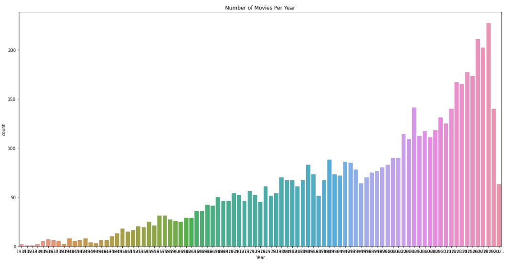
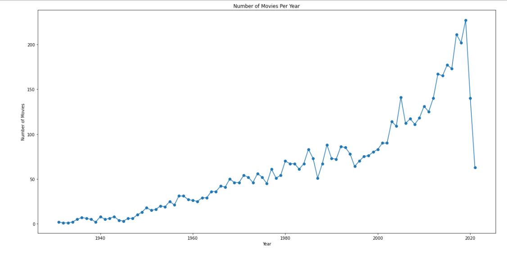

# Movies Rating Prediction

This repository contains code and resources for predicting movie ratings using various machine learning algorithms. The following sections explain the accuracy of each algorithm used and the graphs generated in the project.

## Algorithms and Their Accuracy

### 1. Linear Regression
Linear Regression was used to predict movie ratings based on various features.

- **Training Accuracy:** 0.7285
- **Test Accuracy:** 0.7178
- **Mean Squared Error (MSE):** 0.5170
- **Mean Absolute Error (MAE):** 0.5285
- **R2 Score:** 0.7178

Linear Regression showed decent performance with an R2 score of approximately 0.7178, indicating that about 71.78% of the variance in the movie ratings could be explained by this model.

### 2. Ridge Regression
Ridge Regression, a regularized version of Linear Regression, was used to address potential overfitting.

- **Cross-validation RMSE:** 0.73
- **Test set RMSE:** 0.72

Ridge Regression with cross-validation provided a Root Mean Squared Error (RMSE) of 0.72 on the test set, indicating slightly better performance compared to Linear Regression.

### 3. Support Vector Regression (SVR)
Support Vector Regression was applied to capture non-linear relationships in the data.

- **Training Accuracy:** 0.8046
- **Test Accuracy:** 0.7502
- **Test set RMSE:** 0.68

SVR achieved a higher accuracy compared to both Linear and Ridge Regression, with a training accuracy of 0.8046 and a test accuracy of 0.7502. The lower RMSE of 0.68 also indicates better prediction accuracy.

## Graphs Used in the Project

### 1. Scatter Plot of Actual vs Predicted Values


This plot compares the actual movie ratings with the predicted ratings for the test set. The closer the points are to the diagonal line, the better the model's predictions.

### 2. Residual Plot


The residual plot shows the distribution of prediction errors (residuals). The horizontal red line represents zero error. Ideally, the residuals should be randomly distributed around this line, indicating no obvious patterns.

### 3. Distribution of Residuals


This histogram displays the frequency distribution of residuals. A normal distribution of residuals suggests that the model's errors are evenly distributed.

### 4. Countplot


This countplot shows the number of movies released each year from 1913 to 2021. There is a clear upward trend, especially from the 1980s onward, with a significant increase in the number of movies released per year, peaking in 2021.

### 5. Lineplot


This line plot shows the number of movies released each year from 1913 to 2021. The trend indicates a steady increase in movie production, with noticeable growth starting in the 1980s and significant peaks in the 2010s, before a sharp decline in 2021.

## How to Use

1. Clone the repository:
   ```bash
   https://github.com/1073rajan/Afame-Technologies.git
